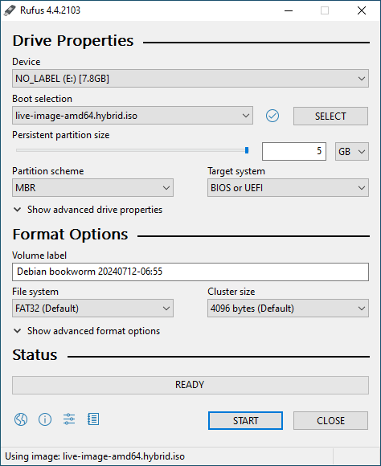

# ktdumper-liveiso

* Download the latest ISO from https://github.com/ktdumper/liveiso/releases
* Download Rufus from https://rufus.ie/en/
* Set up persistent partition like in the screenshot, set size to the max of your USB stick

